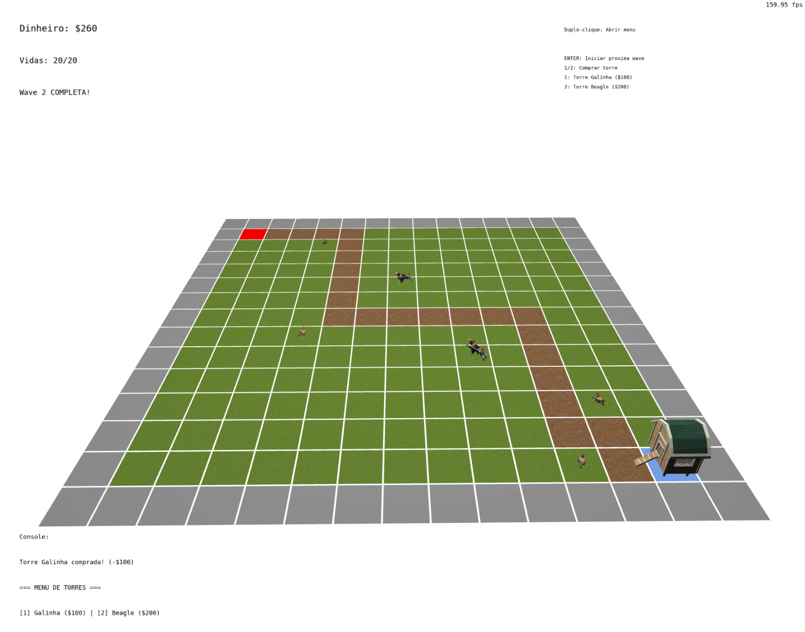
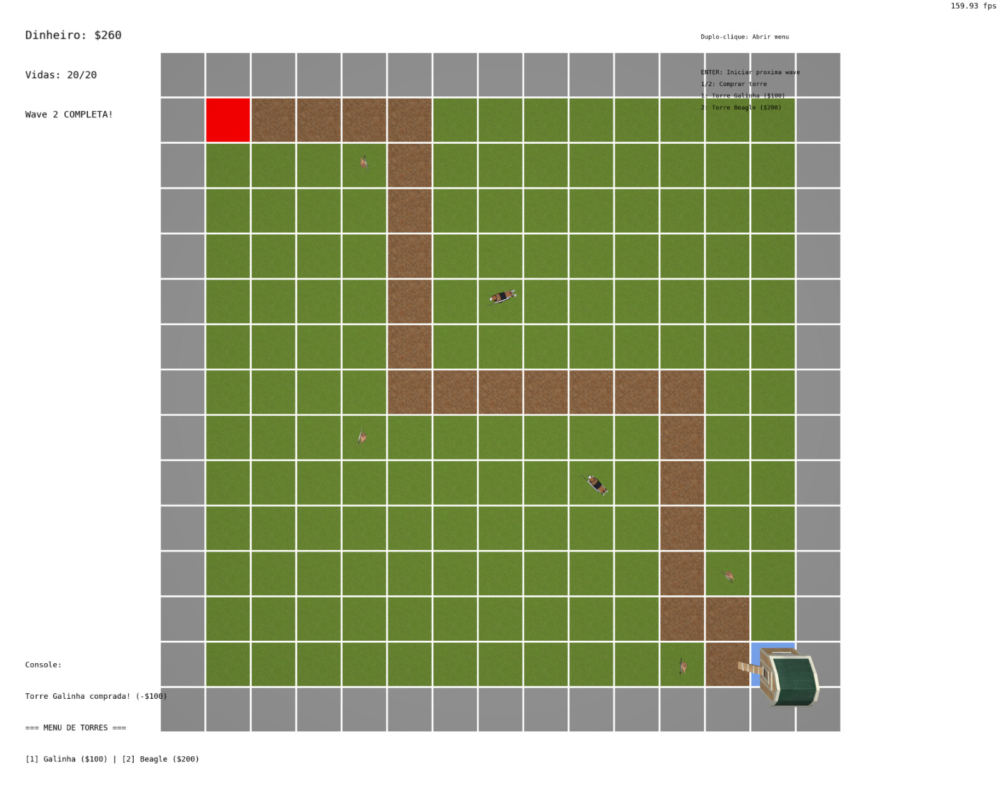

# Ovocídio

**Ovocídio** é um jogo de Tower Defense 3D desenvolvido em C++ com OpenGL, onde o jogador defende um galinheiro contra ondas de inimigos (lobos, raposas, gaviões e ratos). Posicione torres de galinhas e beagles armados para proteger sua base!


*Visão geral do mapa com câmera Look-At*


*Visão top-down do campo de batalha*

## Contribuições

**Bernardo**: Implementação do sistema de torres (posicionamento, seleção, alcance), sistema de projéteis, integração dos modelos 3D das torres e armas, e mecânicas de combate.

**Guillermo**: Implementação dos modelos de iluminação (Lambert, Blinn-Phong, Gouraud) e mecânica de trajetória de projétil.

**Luca**: Desenvolvimento do sistema de inimigos (sistema de waves) com movimentação por curvas de Bézier e modelagem das torres.

## Uso de Ferramentas de IA

Utilizamos ferramentas de IA principalmente para auxiliar no processo de debugging e ma geração de atributos para torres, inimigos e castelo. As ferramentas foram úteis para identificar erros de lógica e sugerir abordagens alternativas durante o desenvolvimento.

## Processo de Desenvolvimento

### Conceitos de Computação Gráfica Implementados

#### 1. Malhas Poligonais Complexas
- Modelos 3D carregados via **tinyobjloader**: galinha, beagle, lobo, raposa, gavião, rato, galinheiro, armas (Thompson e AK-47)
- Todos os modelos possuem complexidade igual ou superior ao modelo de referência "cow.obj"
- Múltiplas instâncias do mesmo modelo são renderizadas usando diferentes Model matrices

#### 2. Transformações Geométricas
- **Model Matrix**: Posicionamento, rotação e escala de todos os objetos (torres, inimigos, projéteis)
- **View Matrix**: Implementada manualmente em `Matrix_Camera_View()` no arquivo `matrices.h`
- **Projection Matrix**: Projeção perspectiva implementada em `Matrix_Perspective()` sem uso de funções prontas (glm::perspective, gluPerspective, etc.)
- Interação via mouse para rotação da câmera e seleção de células do grid

#### 3. Sistemas de Câmera
- **Câmera Look-At**: Câmera orbital controlada pelo mouse, rotaciona ao redor do centro do mapa
- **Câmera Look-Down**: Câmera fixa posicionada acima do mapa, olhando diretamente para baixo (visão top-down)
- Alternância entre câmeras via tecla `C`

#### 4. Instanciamento de Objetos
- O mesmo modelo de galinha/beagle é usado para múltiplas torres, diferenciando apenas pela Model matrix
- Inimigos do mesmo tipo compartilham geometria, com transformações individuais
- Grid do mapa: mesmo modelo de plano renderizado 225 vezes (15x15) com diferentes posições e texturas

#### 5. Testes de Intersecção (arquivo `collisions.cpp`)
- **Esfera-Esfera** (`TestSphereSphere`): Colisão entre projéteis e inimigos
- **Ponto-Esfera** (`TestPointSphere`): Verificação se inimigo está dentro do alcance da torre
- **Esfera-Plano** (`TestSpherePlane`): Limitação de projéteis aos limites do mapa

#### 6. Modelos de Iluminação
- **Lambert (Difuso)**: Aplicado em todos os objetos da cena no Fragment Shader
- **Blinn-Phong (Especular)**: Aplicado nas armas (Thompson, AK-47) e projéteis (ovos) para efeito metálico/brilhante
- **Interpolação de Gouraud**: O galinheiro (`MODEL_CHICKEN_COOP`) tem iluminação calculada no Vertex Shader e interpolada pelo rasterizador
- **Interpolação de Phong**: Demais objetos calculam iluminação por fragmento no Fragment Shader

#### 7. Mapeamento de Texturas
- **12 texturas distintas** aplicadas aos objetos:
  - Grid: grama (`grass.jpg`), caminho (`path.jpg`)
  - Torres: galinha (`chicken.png`), beagle (`beagle.png`)
  - Armas: Thompson (`thompson.png`), AK-47 (`ak47.jpg`)
  - Inimigos: gavião (`hawk.png`), raposa (`fox.png`), lobo (`wolf.png`), rato (`rat.png`)
  - Ambiente: galinheiro (`ChickenCoop.png`)
  - Projétil: ovo (`Egg.png`)
- Coordenadas UV lidas dos arquivos OBJ e passadas para os shaders

#### 8. Curvas de Bézier
- **Movimentação dos inimigos** segue curvas de Bézier cúbicas entre waypoints do caminho
- Implementação da fórmula paramétrica: $B(t) = (1-t)^3P_0 + 3(1-t)^2tP_1 + 3(1-t)t^2P_2 + t^3P_3$
- Pontos de controle calculados automaticamente com base na tangente do caminho
- Suavização configurável via constante `ENEMY_BEZIER_SMOOTHNESS`

#### 9. Animação Baseada no Tempo
- Todas as movimentações usam `deltaTime` para independência de framerate:
  - Física das torres (gravidade ao spawnar)
  - Movimento dos inimigos pelo caminho
  - Velocidade dos projéteis
  - Cooldown de ataque das torres

## Manual de Utilização

### Controles

| Tecla/Ação | Função |
|------------|--------|
| **Mouse (arrastar)** | Rotacionar câmera Look-At |
| **Scroll do Mouse** | Zoom in/out |
| **Clique Esquerdo** | Selecionar torre |
| **Clique Duplo** | Abrir menu de compra de torre |
| **Clique Direito** | Desselecionar torre / Fechar menu |
| **1** | Comprar Torre Galinha (quando menu aberto) |
| **2** | Comprar Torre Beagle (quando menu aberto) |
| **C** | Alternar entre câmera Look-At e Look-Down |
| **Enter** | Iniciar próxima wave de inimigos |
| **E** | Spawnar lobo (debug) |
| **H** | Spawnar gavião (debug) |
| **F** | Spawnar raposa (debug) |
| **R** | Spawnar rato (debug) |
| **ESC** | Sair do jogo |

### Gameplay

1. **Início**: O jogo começa com o mapa vazio. Use a câmera para visualizar o terreno.

2. **Posicionamento de Torres**: 
   - Dê um clique duplo em uma célula vazia (grama) para abrir o menu de compra
   - Pressione `1` para Torre Galinha ou `2` para Torre Beagle
   - Torres são posicionadas e caem com gravidade até o chão

3. **Waves de Inimigos**: 
   - Pressione `Enter` para iniciar uma wave
   - Inimigos seguem o caminho (células marrons) até a base (azul)
   - Torres atacam automaticamente inimigos dentro do alcance

4. **Seleção de Torres**:
   - Clique em uma torre para selecioná-la
   - Um círculo amarelo mostra o alcance de ataque
   - Informações da torre são exibidas no console

5. **Objetivo**: Impedir que inimigos cheguem à base. Cada inimigo que chega reduz suas vidas.

## Requisitos do Sistema

- C++ compiler (GCC/Clang ou MSVC)
- CMake (recomendado) ou Make
- OpenGL 3.3+ drivers
- GLFW3 (headers de desenvolvimento)
- Ferramentas de build: build-essential, make

### Instalação de Dependências

#### Debian/Ubuntu:
```bash
sudo apt-get install cmake build-essential make libx11-dev libxrandr-dev \
                     libxinerama-dev libxcursor-dev libxcb1-dev libxext-dev \
                     libxrender-dev libxfixes-dev libxau-dev libxdmcp-dev
```

Pacotes adicionais para Linux Mint:
```bash
sudo apt-get install libmesa-dev libxxf86vm-dev
```

#### RedHat/Fedora:
```bash
sudo dnf install cmake g++ glfw-devel libXxf86vm-devel
```

#### Windows (MSYS2/MinGW):
```bash
pacman -S --needed base-devel mingw-w64-ucrt-x86_64-toolchain
```

#### macOS:
```bash
brew install glfw
```

## Compilação e Execução

### Opção 1: Makefile (Linux/macOS)

```bash
make
make run
```

No macOS, use o Makefile específico:
```bash
make -f Makefile.macOS
make -f Makefile.macOS run
```

### Opção 2: CMake (recomendado)

```bash
mkdir build
cd build
cmake ..
make
make run
```

O executável será gerado em `bin/Linux/` (ou subpasta apropriada para sua plataforma).

### Opção 3: VSCode

1. Instale as extensões: `ms-vscode.cpptools` e `ms-vscode.cmake-tools`
2. Abra a pasta do projeto no VSCode
3. Use o botão "Play" do CMake Tools na barra de status para configurar, compilar e executar

### Opção 4: Windows com VSCode (MinGW)

1. Instale um toolchain GCC (MinGW-w64 ou MSYS2)
2. Instale o CMake
3. Instale as extensões `ms-vscode.cpptools` e `ms-vscode.cmake-tools`
4. Configure o CMake Tools para incluir a pasta `bin` do GCC em `additionalCompilerSearchDirs`
5. Use o botão Play do CMake Tools

## Solução de Problemas

- **Programa não executa**: Atualize os drivers da GPU
- **Windows - Erro de path**: Não extraia o projeto em caminhos com espaços
- **Linux - Bibliotecas faltando**: Instale os pacotes de desenvolvimento listados acima

## Estrutura do Projeto

```
├── src/                    # Código fonte
│   ├── main.cpp            # Loop principal e callbacks
│   ├── tower_system.cpp    # Sistema de torres
│   ├── enemy_system.cpp    # Sistema de inimigos e Bézier
│   ├── projectile_system.cpp # Sistema de projéteis
│   ├── collisions.cpp      # Testes de intersecção
│   ├── resource_loader.cpp # Carregamento de modelos/texturas
│   ├── shader_vertex.glsl  # Vertex shader (Gouraud)
│   └── shader_fragment.glsl # Fragment shader (Phong, Blinn-Phong)
├── include/                # Headers
├── data/                   # Assets do jogo
│   ├── models/             # Modelos OBJ
│   └── textures/           # Texturas PNG/JPG
├── lib/                    # Bibliotecas por plataforma
├── CMakeLists.txt          # Configuração CMake
├── Makefile                # Regras de build Linux
└── Makefile.macOS          # Regras de build macOS
```
